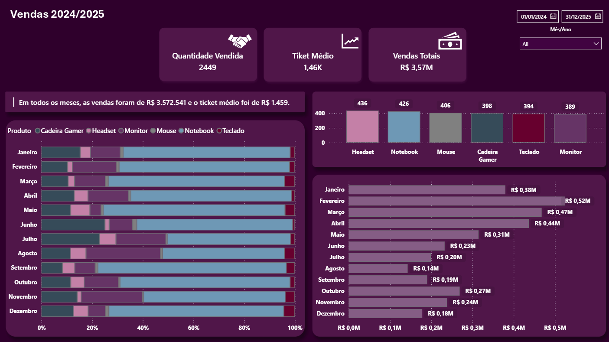
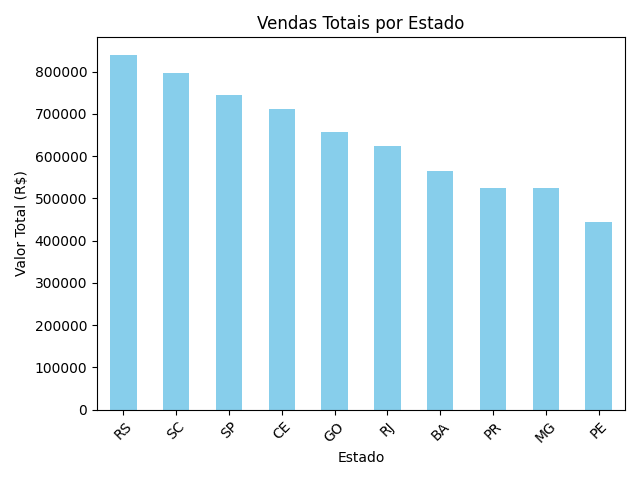
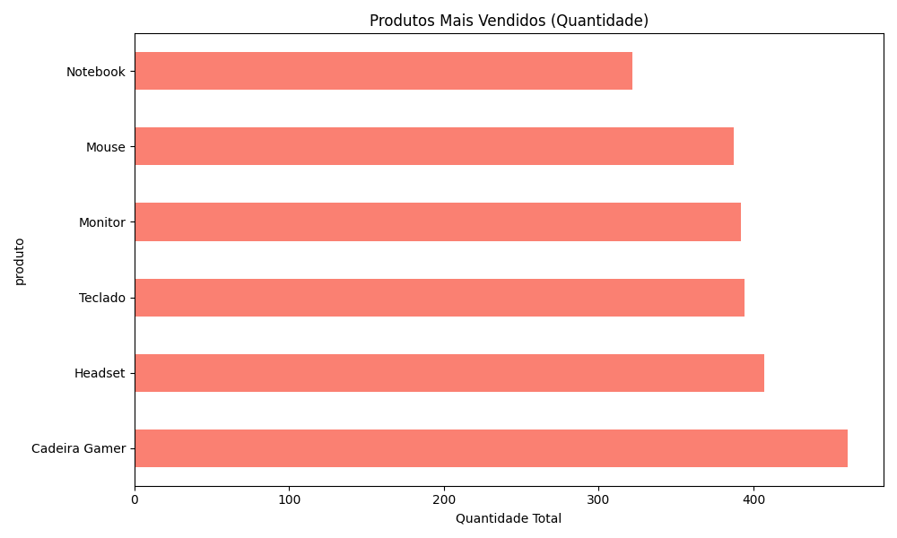

# 📊 Dashboard Vendas


Este projeto apresenta uma solução completa para análise de dados de vendas. O objetivo foi eliminar o processamento manual propenso a erros, desenvolvendo um pipeline que realiza desde a extração e limpeza de dados corrompidos no Excel até a geração de um Dashboard estratégico interativo.

## 🚀 O Problema e a Solução
A base de dados original (`vendas.xlsx`) continha inconsistências de formatação (erros de tipagem e valores `#VALOR!`). 
Através de um script automatizado em Python, foi possível higienizar os dados, calcular faturamentos reais, segmentar métricas regionais e, por fim, conectar a base tratada a um painel de BI para tomada de decisão.

## 📸 Preview do Dashboard



## 🛠️ Tecnologias Utilizadas

* **Python:** Automação e script principal (`analise.py`).
* **Pandas:** Limpeza de dados (tratamento de valores `NaN`, conversão de `datetime` e numéricos) e manipulação estrutural.
* **Matplotlib:** Geração rápida de gráficos exploratórios.
* **Power BI:** Desenvolvimento de painel interativo (UI/UX customizada utilizando fundos desenhados).
* **Excel:** Manipulação de arquivos I/O (`.xlsx`).

## ⚙️ Principais Funcionalidades do Script

1. **Limpeza e Conversão:** Tratamento coercitivo de dados corrompidos nas colunas de preço e quantidade.
2. **Cálculos Consolidados:** Geração automática da coluna `valor_total` (Quantidade x Preço).
3. **Análise Macro e Micro:** 
   - Faturamento geral e Ticket Médio.
   - Ranking de vendas por Estado e volume por Produto.
   - Geração de relatórios segmentados (ex: Exportação exclusiva da base de São Paulo).
4. **Automação de Outputs:** Geração de novos arquivos prontos para o BI (`vendas_finalizadas.xlsx`, `vendas_apenas_SP.xlsx`).

## 📈 Visualizações Geradas pelo Python

Ao rodar o script, além dos arquivos Excel tratados, gráficos analíticos são gerados automaticamente para avaliação rápida:

| Vendas Totais por Estado | Volume de Produtos Mais Vendidos |
| :---: | :---: |
|  |  |

## 💻 Como executar o projeto localmente

1. Clone este repositório:
```bash
   git clone [https://github.com/SEU-USUARIO/SEU-REPOSITORIO.git](https://github.com/SEU-USUARIO/SEU-REPOSITORIO.git)
